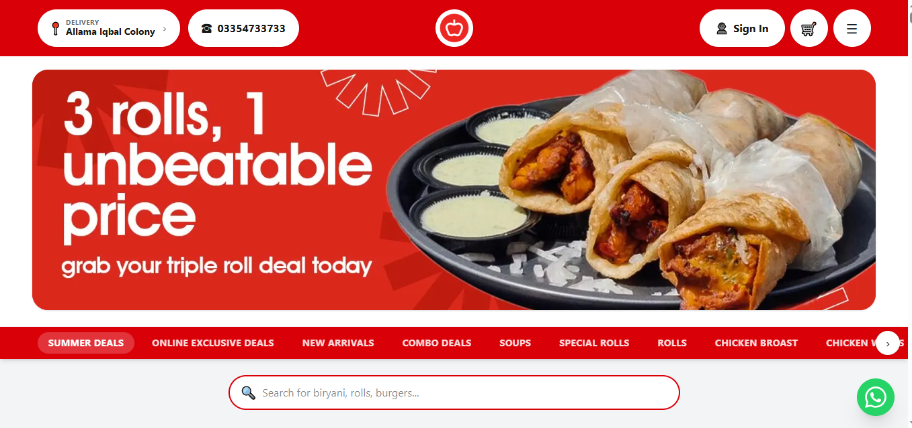

# M Kashan Malik Awan

### Full Stack Developer at Jzarr

Full Stack Developer focused on building modern, scalable, and production-ready applications across web, mobile, desktop, and backend systems.

I work across the complete development lifecycle — from frontend interfaces and mobile applications to backend architecture, APIs, databases, and integrations.

---

## About

- Full Stack Developer at **Jzarr**
- Building modern web applications with **React and Next.js**
- Developing mobile applications with **Flutter and React Native**
- Building cross-platform desktop applications with **Electron**
- Developing backend systems with **Node.js, NestJS, Express.js, Laravel, PHP, and Python**
- Working with both SQL and NoSQL databases
- Interested in scalable architecture, performance, clean code, and reliable software

---

# Technology Stack

## Web Development

<table>
<tr>

<td align="center" width="120">

 
<strong>React</strong>
</td>

<td align="center" width="120">

 
<strong>Next.js</strong>
</td>

<td align="center" width="120">

 
<strong>JavaScript</strong>
</td>

<td align="center" width="120">

 
<strong>TypeScript</strong>
</td>

<td align="center" width="120">

 
<strong>HTML5</strong>
</td>

<td align="center" width="120">

 
<strong>CSS3</strong>
</td>

</tr>
</table>

---

## Mobile Development

<table>
<tr>

<td align="center" width="120">

 
<strong>Flutter</strong>
</td>

<td align="center" width="120">

 
<strong>Dart</strong>
</td>

<td align="center" width="120">

 
<strong>React Native</strong>
</td>

</tr>
</table>

---

## Desktop Development

<table>
<tr>

<td align="center" width="120">

 
<strong>Electron</strong>
</td>

</tr>
</table>

---

## Backend & APIs

<table>
<tr>

<td align="center" width="120">

 
<strong>Node.js</strong>
</td>

<td align="center" width="120">

 
<strong>Express.js</strong>
</td>

<td align="center" width="120">

 
<strong>NestJS</strong>
</td>

<td align="center" width="120">

 
<strong>Python</strong>
</td>

<td align="center" width="120">

 
<strong>PHP</strong>
</td>

<td align="center" width="120">

 
<strong>Laravel</strong>
</td>

</tr>
</table>

---

## Databases

<table>
<tr>

<td align="center" width="120">

 
<strong>MongoDB</strong>
</td>

<td align="center" width="120">

 
<strong>MySQL</strong>
</td>

<td align="center" width="120">

 
<strong>PostgreSQL</strong>
</td>

<td align="center" width="120">

 
<strong>SQLite</strong>
</td>

</tr>
</table>

---

## Development Tools

<table>
<tr>

<td align="center" width="120">

 
<strong>Git</strong>
</td>

<td align="center" width="120">

 
<strong>GitHub</strong>
</td>

<td align="center" width="120">

 
<strong>VS Code</strong>
</td>

</tr>
</table>

---

# What I Build

<table>
<tr>
<th>Area</th>
<th>Focus</th>
</tr>

<tr>
<td><strong>Web Applications</strong></td>
<td>Modern, responsive, and scalable web applications</td>
</tr>

<tr>
<td><strong>Mobile Applications</strong></td>
<td>Cross-platform applications for Android and iOS</td>
</tr>

<tr>
<td><strong>Desktop Applications</strong></td>
<td>Cross-platform desktop applications with Electron</td>
</tr>

<tr>
<td><strong>Backend Systems</strong></td>
<td>APIs, services, business logic, and application architecture</td>
</tr>

<tr>
<td><strong>Database Systems</strong></td>
<td>SQL and NoSQL database design and integration</td>
</tr>

<tr>
<td><strong>API Integrations</strong></td>
<td>Third-party services and application integrations</td>
</tr>

<tr>
<td><strong>Authentication</strong></td>
<td>Authentication and authorization systems</td>
</tr>

</table>

---

# GitHub Activity

  

---

# Featured Project

## Red Apple

<table>
<tr>

<td width="55%" valign="top">

</td>

<td width="45%" valign="top">

<h3>Red Apple</h3>

A modern food ordering and e-commerce platform designed to provide customers with a smooth, fast, and convenient online ordering experience.

<h4>Highlights</h4>

<ul>
<li>Modern and responsive user interface</li>
<li>Food categories and product browsing</li>
<li>Product search and filtering</li>
<li>Online ordering experience</li>
<li>Mobile-friendly design</li>
<li>Scalable backend architecture</li>
<li>Structured database architecture</li>
</ul>

<h4>Technology Stack</h4>

<strong>Next.js</strong> ·
<strong>NestJS</strong> ·
<strong>TypeScript</strong> ·
<strong>PostgreSQL</strong>

</td>

</tr>
</table>

> The source repository for this project is private and is therefore not publicly linked.

---

# Let's Connect

<a href="mailto:kashan@jzarr.com">kashan@jzarr.com</a>

---

<strong>Kashan Malik Awan</strong>

 

Full Stack Developer · Web · Mobile · Desktop · Backend

© 2026 Kashan Malik Awan

